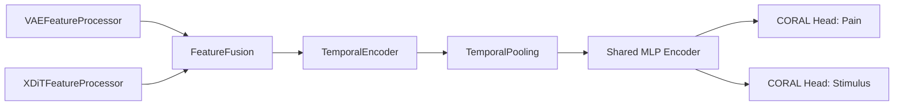

# Multimodal Pipeline for Multi-Task Ordinal Classification

## Overview
This pipeline implements a modular, extensible framework for multimodal feature fusion and multi-task ordinal regression (CORAL) in PyTorch Lightning. It is designed to combine VAE and xDiT features, perform temporal modeling, and support multi-task learning (e.g., pain and stimulus prediction) with robust configuration and metrics.

## Modules and Classes

### 1. VAEFeatureProcessor
- Processes VAE features using a 3D ResNet backbone.
- Projects features to a configurable dimension `(B, T, D)`.
- Preserves the temporal dimension for downstream modeling.

### 2. XDiTFeatureProcessor
- Processes xDiT features using a linear layer and BatchNorm.
- Projects features to `(B, T, D)`.
- Efficient, vectorized implementation.

### 3. FeatureFusion
- Concatenates VAE and xDiT features along the feature dimension.
- Projects to a common fusion dimension.
- Supports BatchNorm, activation, dropout, optional residual connection, and LayerNorm.

### 4. TemporalEncoder
- Encodes temporal information using either a Bidirectional GRU or Transformer Encoder.
- Supports learnable positional encoding (Transformer), LayerNorm, and dropout.
- Output shape: `(B, T, D)`.

### 5. TemporalPooling
- Pools the temporal dimension to produce a fixed-size feature `(B, D)`.
- Supports 'mean', 'max', and 'cls' pooling strategies.

### 6. Shared MLP Encoder
- MLP applied after temporal pooling, before the CORAL heads.
- Configurable hidden dimensions, dropout, and batch normalization.

### 7. MultimodalMultiTaskCoralClassifier
- Assembles all the above modules into a full multimodal, multi-task classifier.
- Implements CORAL heads for pain and stimulus tasks.
- Computes and logs MAE, QWK, and Accuracy for both tasks.
- Supports learning rate scheduling, optimizer configuration, and a sanity check method.

### 8. BioVidMultimodalCoralClassifier
- Inherits from MultimodalMultiTaskCoralClassifier.
- Always uses 'val_stim_QWK' as the monitor metric for LR scheduling (BioVid-specific best practice).

## Configuration and Extensibility
- All modules are highly configurable via constructor arguments and `self.save_hyperparameters()`.
- Designed for use with Hydra/CLI for experiment management.
- Supports easy extension (e.g., new fusion strategies, temporal encoders, pooling methods).

## Example Usage
```python
from classifier.multimodal import MultimodalMultiTaskCoralClassifier

model = MultimodalMultiTaskCoralClassifier(
    vae_in_channels=16,
    xdit_in_channels=32,
    feature_dim=128,
    fusion_dim=256,
    temporal_encoder_dim=256,  # for config compatibility
    num_pain_classes=5,
    num_stimulus_classes=5,
    shared_mlp_hidden_dims=[256, 128],
    shared_mlp_dropout=0.5,
    fusion_dropout=0.1,
    fusion_activation='relu',
    fusion_use_residual=True,
    fusion_use_layernorm=True,
    temporal_encoder_type='transformer',
    temporal_encoder_nhead=8,
    temporal_encoder_num_layers=2,
    temporal_encoder_dropout=0.2,
    temporal_encoder_max_len=64,
    temporal_encoder_use_layernorm=True,
    temporal_pooling_type='mean',
    learning_rate=1e-4,
    optimizer_name='AdamW',
    pain_loss_weight=1.0,
    stim_loss_weight=1.0,
    weight_decay=0.01,
    label_smoothing=0.05,
    use_distance_penalty=True,
    focal_gamma=2.0,
    class_weights=None
)
```

## Compatibility
- To use the full temporal modeling pipeline, set `temporal_pooling='none'` and `flatten=False` in your data module config.
- The model expects input tensors of shape `(B, C, T, H, W)` for both VAE and xDiT features.
- Output is always compatible with CORAL heads and downstream multi-task evaluation.

## Design Notes & Best Practices
- All pooling, fusion, and temporal modeling is performed inside the model for modularity and reproducibility.
- Metrics and logging are implemented for both tasks and all stages.
- The pipeline is ready for extension to more modalities, advanced fusion, or attention pooling.

## References
- See `README_classifier.md` for CORAL and multi-task background.
- See `README_feature_extraction.md` for details on VAE/xDiT feature extraction.
- See `README_training.md` for training script integration.

## Architecture Diagram

